# Puppy

### Machine Information

| Property | Value |
|----------|-------|
| Platform | Hack The Box |
| Category | Active Directory |
| Difficulty | Medium |

---

### Scenario

This machine begins with an **assumed breach** scenario where valid domain credentials are already provided.

**Initial Credentials**

```text
Username : levi.james
Password : KingofAkron2025!
```

---

### Initial Enumeration

A quick Nmap scan was performed to identify the exposed services.

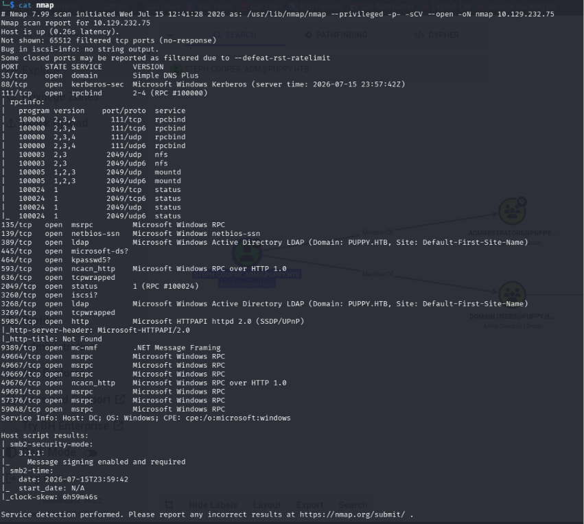

SMB enumeration did not reveal any interesting shares. Apart from the default administrative shares, there was a non-standard **DEV** share, but the compromised account did not have permission to access it.

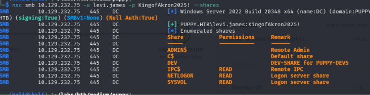

To prepare for password spraying later in the engagement, all domain usernames were enumerated using NetExec's `--rid-brute` option. The output was cleaned using the `cut` command to extract only the usernames.

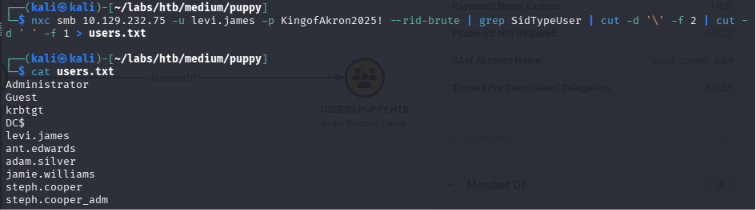

---

### Active Directory Enumeration

Since the initial SMB enumeration yielded little information, BloodHound was used to identify the relationships within the domain.

```bash
bloodhound-python -d puppy.htb -c all -u levi.james -p KingofAkron2025! -ns 10.129.232.75 --dns-tcp --zip
```

The BloodHound analysis revealed that **levi.james** had **GenericWrite** permissions over the **Developers** group.

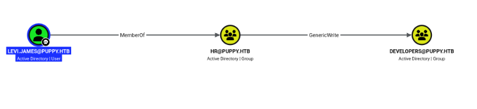

BloodHound provides both Windows and Linux abuse techniques for this privilege. Since the attack was performed from Kali Linux, Samba's `net rpc` utility was used to add the compromised user to the **Developers** group.

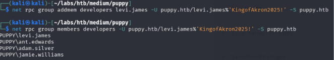


---

### KeePass Database Recovery

After becoming a member of the group, access to the previously restricted **DEV** SMB share was granted.

Inside the **DEV** share, a KeePass database named **recovery.kdbx** was discovered.

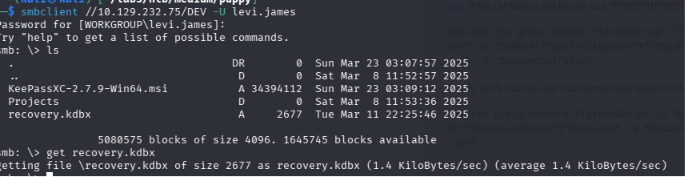

The database password was recovered using **keepass4brute**. I initially attempted to use keepass2john tool to extract the hash, but encountered compatibility issues while trying to crack the database.

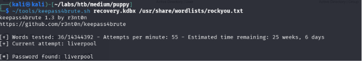

Once unlocked, the database contained credentials for multiple domain users. These credentials were saved in "passwords" file locally and used in a password spray attack against the enumerated user list.

The spray identified two valid sets of domain credentials.

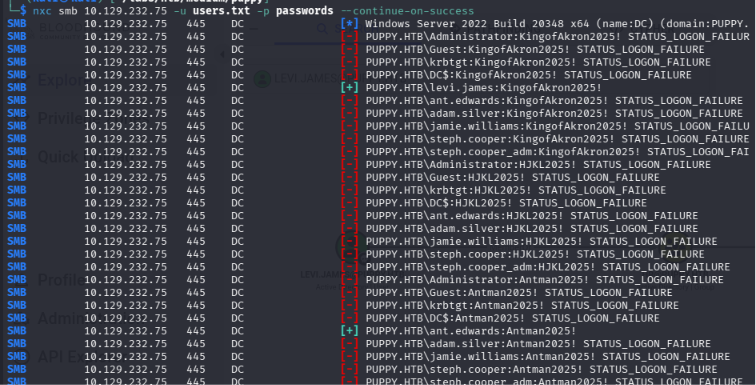

---

### GenericAll Abuse

BloodHound showed that **ant.edwards** is **not** a member of the **Remote Management Users** group, meaning WinRM access is not available. However, the account possessed a more interesting privilege: **GenericAll** over **adam.silver**.

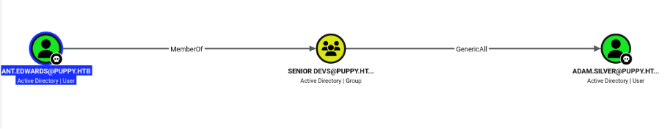

The same abuse technique was used to reset **adam.silver's** password via samba's net tool.

When validating the credentials, authentication returned **STATUS_ACCOUNT_DISABLED**. Further research showed that the account could be re-enabled using **bloodyAD**.

Once the account was enabled, authentication succeeded and, because **adam.silver** belonged to the **Remote Management Users** group, a WinRM session could be established.

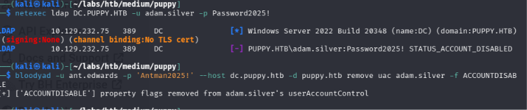

After obtaining shell access, the user flag was retrieved from the Desktop.

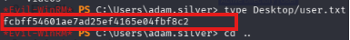

---

### Host Enumeration

Further enumeration of the host revealed an unusual **Backup** directory in the root folder.

The backup archive was transferred to the attack machine using an SMB share created with **Impacket SMB Server**.

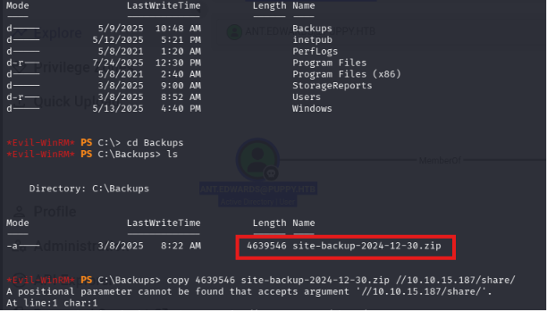

After extracting the archive, a `.bak` file was discovered containing the plaintext password for **steph.cooper**.

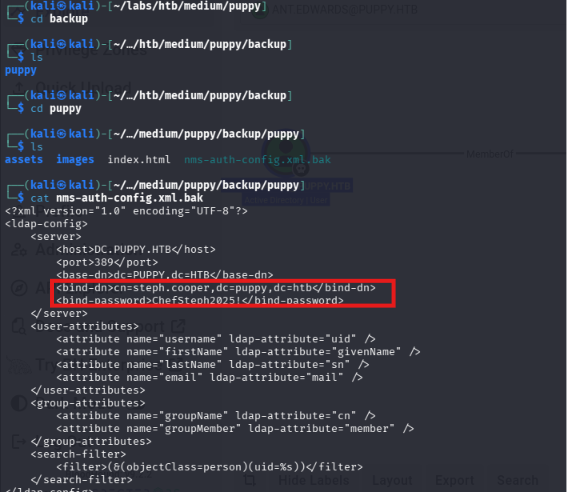

---

### DPAPI Credential Recovery

While enumerating **steph.cooper's** profile, the **Microsoft\\Credentials** and **Microsoft\\Protect** directories contained both a DPAPI credential blob and its corresponding master key.

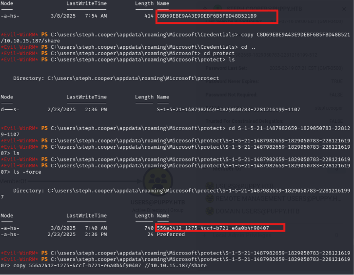

Both files were transferred to the attack machine using the previously created SMB share.

The master key was decrypted using Impacket's DPAPI implementation.

```bash
impacket-dpapi masterkey -file 556a2412-1275-4ccf-b721-e6a0b4f90407 -sid S-1-5-21-1487982659-1829050783-2281216199-1107 -password ChefSteph2025!
```

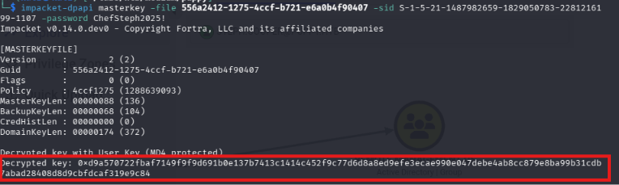

The recovered master key was then supplied to decrypt the DPAPI credential blob.

```bash
impacket-dpapi credential -file C8D69EBE9A43E9DEBF6B5FBD48B521B9 -key <Recovered Master Key>
```

This revealed the credentials for **steph.cooper_adm**.

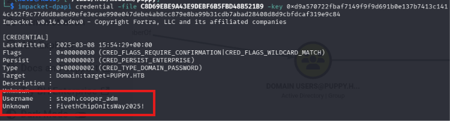

---

### Administrator Access

BloodHound confirmed that **steph.cooper_adm** was a member of the **Administrators** group.

Using these recovered credentials, an Administrator shell was obtained with **Impacket PsExec**.


Finally, the root flag was retrieved, completing the compromise of the domain.

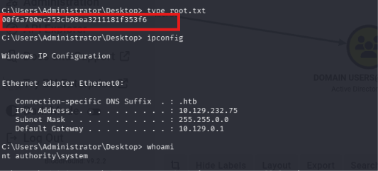

---

### Lessons Learned

- Learned how Active Directory handles disabled user accounts and how they can be re-enabled using `bloodyAD` when the appropriate privileges are available.
- Gained hands-on experience recovering DPAPI-protected credentials by decrypting a user's master key and using it to recover stored credentials with Impacket.
