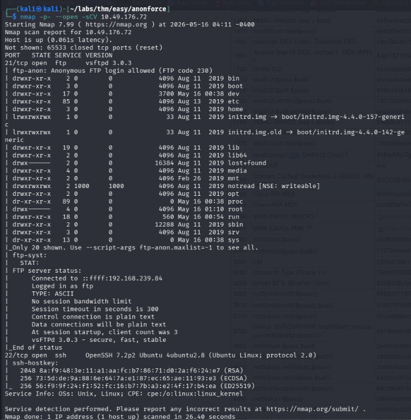
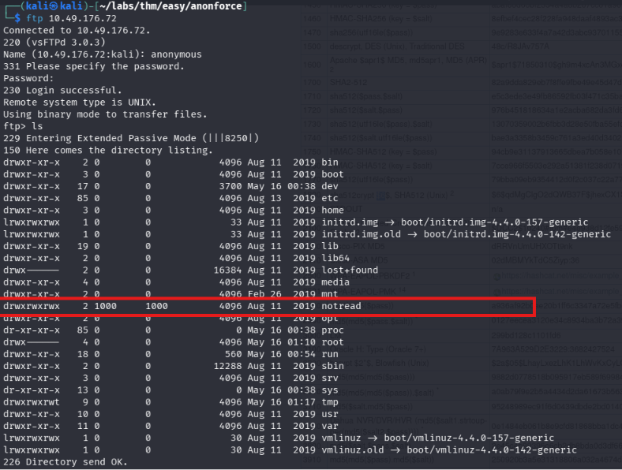
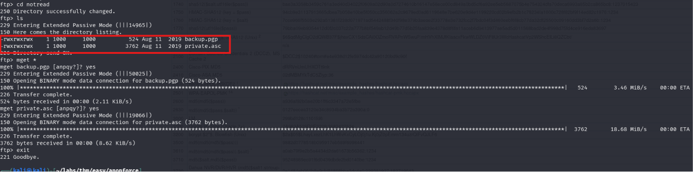
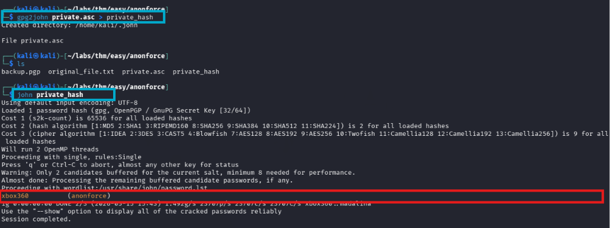
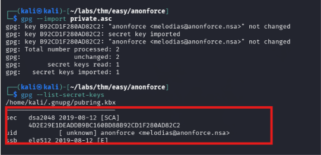
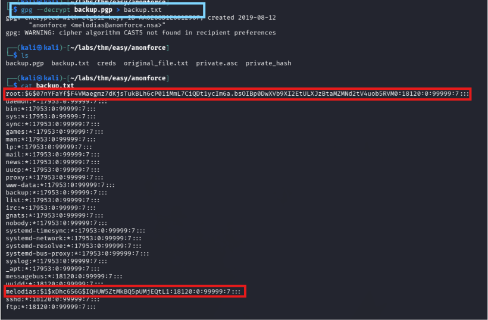
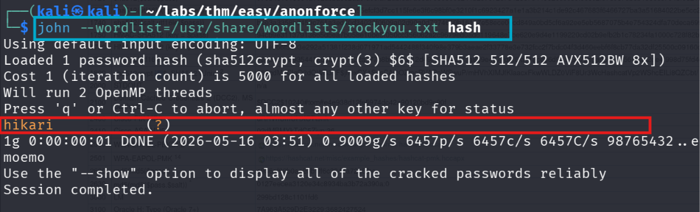
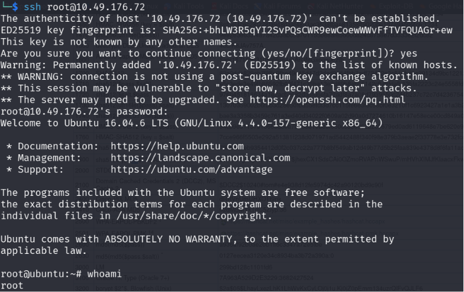
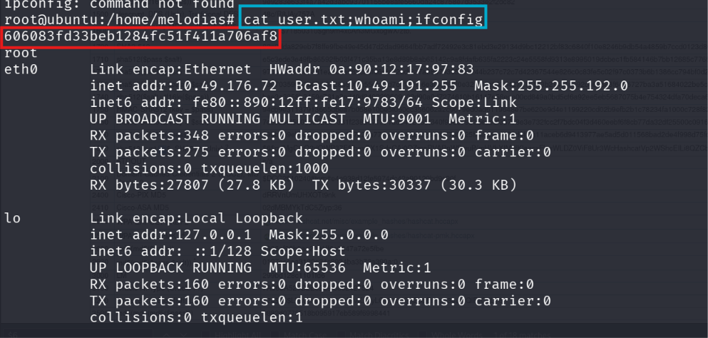
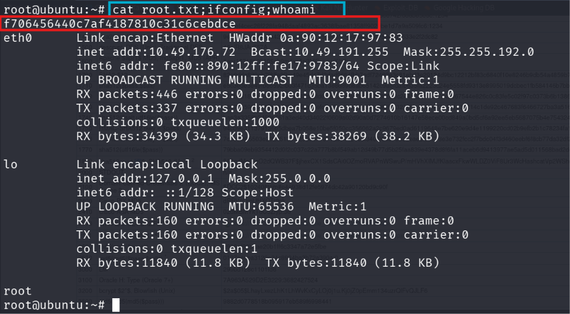

# Anonforce

## Machine Information

| Property | Value |
|----------|-------|
| Platform | TryHackMe |
| Category | Linux |
| Difficulty | Easy |
| Skills | FTP Enumeration, GPG, Password Cracking, SSH |

---

## Objective

Gain access to the target machine by enumerating an anonymously accessible FTP service, recovering encrypted backup files, and obtaining valid SSH credentials.

---

## Attack Path

```
Reconnaissance
        │
        ▼
FTP Enumeration
        │
        ▼
Anonymous Login
        │
        ▼
GPG Key Discovery
        │
        ▼
Decrypt Backup
        │
        ▼
Password Cracking
        │
        ▼
SSH Access
        │
        ▼
Root
```

---

## Enumeration

### Nmap Scan

A full TCP scan was performed to identify the exposed services.

```bash
nmap -p- -sCV -oN nmap <TARGET_IP>
```



---

### FTP Enumeration

The FTP service permitted anonymous authentication.

```bash
ftp <TARGET_IP>
```

After logging in anonymously, the root directory was enumerated.

Most directories contained standard files; however, a directory named **notread** appeared interesting and warranted further investigation.



---

### Interesting Files

Inside the **notread** directory, two files were discovered.

```
private.asc
backup.pgp
```

The `private.asc` file appeared to be a GPG private key, while `backup.pgp` appeared to be an encrypted backup.



---

## Initial Access

### Importing the Private Key

An attempt was made to import the private key.

```bash
gpg --import private.asc
```

The key required a passphrase before it could be imported successfully.
The private key was converted into a John the Ripper compatible format and cracked.



---

### Recovering the Passphrase

After recovering the passphrase, the key was imported successfully.

```bash
gpg --import private.asc
```

The imported secret keys were verified using:

```bash
gpg --list-secret-keys
```



---

### Decrypting the Backup

With the private key available, the encrypted backup was decrypted.

```bash
gpg --decrypt backup.pgp > backup.txt
```

The decrypted backup contained password hashes for the following users:

```
root
meliodas
```



---

### Password Cracking

The extracted password hashes were supplied to John the Ripper.

The password for the **root** account was successfully recovered.

```
root : hikari
```


The password for **meliodas** could not be cracked.

---

### SSH Login

The recovered credentials were used to authenticate via SSH.

```bash
ssh root@<TARGET_IP>
```

Authentication succeeded, providing a root shell.



---

## Post Exploitation

The user flag was retrieved from the home directory.

```
/home/meliodas/user.txt
```



---

## Root Access

Since the compromised account was already **root**, the root flag was immediately accessible.

```
/root/root.txt
```



---

## Tools Used

- Nmap
- FTP
- GPG
- John the Ripper
- SSH

---

## Lessons Learned

- Sensitive backup files should never be stored in locations accessible through anonymous FTP.
- Backup and encrypted files may expose sensitive credentials when improperly protected.
- GPG private keys can often be attacked by recovering their passphrases.
- Password reuse across services can provide direct access through SSH.

